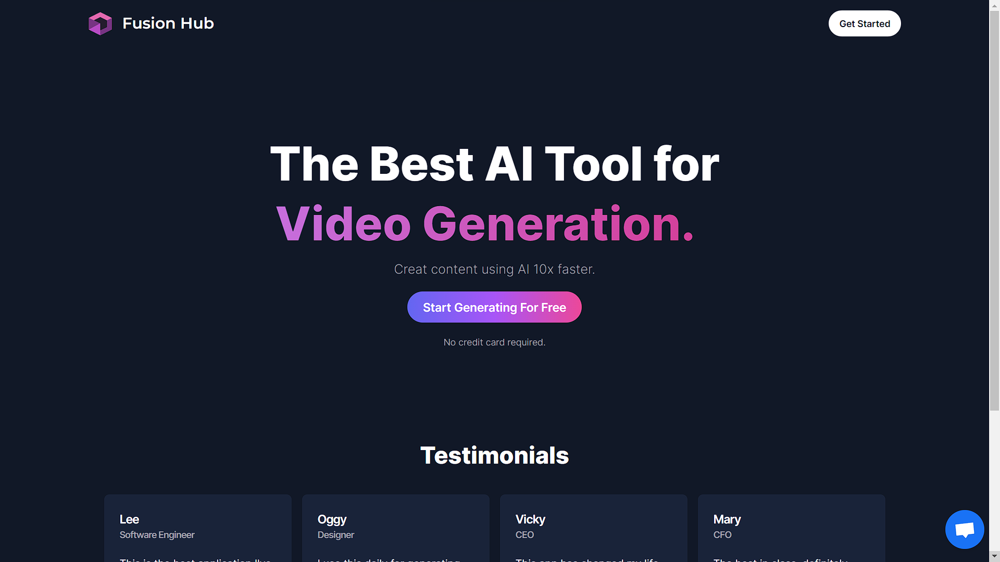

# Fusion Hub AI SaaS Platform

Welcome to Fusion Hub AI SaaS Platform, a project built with Next.js 14, React, Tailwind, Prisma, Clerk, Stripe, Crisp, and more!

## Features

- Seamless integration of animations and effects for  enhanced user experience using Tailwind CSS.
- Responsive and modern design  ensures a consistent and enjoyable user interface across devices of all sizes.
- Seamless user authentication with Clerk.
- Implement POST, DELETE, and GET routes in route handlers under app/api for efficient API communication.
- Fetch data directly from the database in server React components for faster rendering.
- Optimize code structure by reusing layouts for consistent design patterns.
- Integration with Stripe for secure and convenient monthly subscription payments.
- Generate engaging and dynamic conversations using Open AI.
- Generate codes, images using cutting-edge AI from Open AI.
- Generate videos and music using Replicate AI.
- Offer a free tier with limitations on API usage for user flexibility.
- Real-time customer support with Crisp.
- Well-organized folder structure in Next.js 14 App Router for easy navigation and maintenance.

## Prerequisites

- Node.js version 14.x.x
